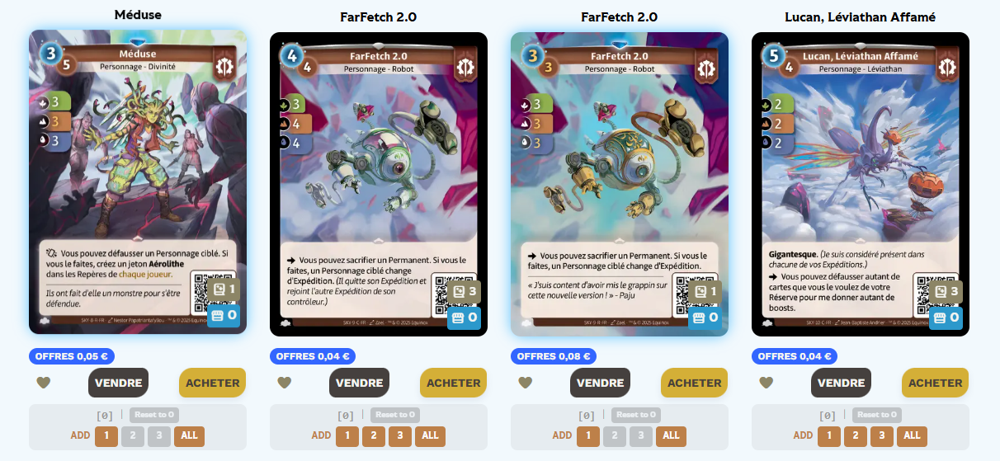

# Altered Fast Trading

A Chrome Extension for automating card transfers on [altered.gg](https://www.altered.gg). Add cards to a trading list directly from your collection page and send them to friends.




## Features

- **Quick Add Buttons**: Inject ADD buttons (1, 2, 3, ALL) under each card in your collection
- **Card List Management**: Build a list of cards to transfer with quantities
- **Batch Transfer**: Send multiple cards to a friend with 2-second delays to avoid rate limiting
- **Progress Tracking**: Visual progress bar and detailed transfer reports
- **Auto-Download Reports**: Get a summary of successful and failed transfers
- **Multi-Locale Support**: Works with fr-fr, en-us, and other locales

/!\ ADD buttons will does not appear under UNIQUE /!\


## Installation

1. Clone or download this repository
2. Open Chrome and go to `chrome://extensions`
3. Enable "Developer mode" (toggle in top-right)
4. Click "Load unpacked" and select the extension folder
5. The extension icon should appear in your toolbar

## Setup

### First Time Setup

1. Open [altered.gg](https://www.altered.gg) and log in
2. Navigate to your collection page (e.g., `/fr-fr/cards?collection=true`)
3. Click the extension icon to open the popup
4. Click **"Refresh Card Dictionary"** to build the card database
   - This takes ~20-60 seconds depending on your connection
   - Only needs to be done once per locale (if you change the website language, you have to refresh!)
5. Refresh the altered.gg page - ADD buttons will appear under your cards

### Sending cards

6. Review the card list. You can click on "View Recap" for visual list.
7. Select the RIGHT user from the dropdown.
8. Press "Start Transfer"

### Locale Matching

The dictionary must match your page locale. If you see a warning about locale mismatch:
1. Navigate to an altered.gg page in your preferred language
2. Click "Refresh Card Dictionary" again
3. Refresh the page

## Usage

### Adding Cards to List

On your collection page:
- Click **1**, **2**, **3** to add that quantity
- Click **ALL** to add all available copies
- The **Give [0]** counter shows how many you've added
- Click **Reset to 0** to remove a card from the list

### Transferring Cards

1. Open the extension popup
2. Select a friend from the dropdown
3. Review your card list in the textarea
4. Click **Start Transfer**
5. Wait for completion - a report will auto-download

### Card List Format

```
2 ALT_CORE_B_BR_19_C
1 ALT_CORE_B_AX_02_C
9 ALT_CORE_B_AX_20_C
```

Format: `Quantity Reference`

## Permissions

- `storage`: Save card list and dictionary
- `scripting`: Inject buttons into altered.gg pages
- `host_permissions`: Access altered.gg and api.altered.gg

## Development

### Project Structure

```
altered-fast-trading/
├── manifest.json       # Extension manifest (v3)
├── background.js       # Service worker (API calls, dictionary)
├── content.js          # Injected into altered.gg (buttons)
├── popup.html          # Extension popup UI
├── popup.js            # Popup logic
├── popup.css           # Popup styles
└── altered-deckfmt.js  # Deck format encoder
```

### Building the Dictionary

The dictionary maps image hashes to card references. Each locale has different hashes, so it must be rebuilt when changing languages.

## Credits

- [altered-deckfmt](https://github.com/Taum/altered-deckfmt) - Deck format encoding library

## License

MIT

## Disclaimer

This extension is not affiliated with Equinox or altered.gg. Use at your own risk.
