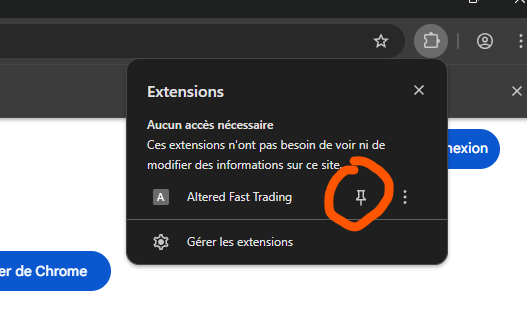
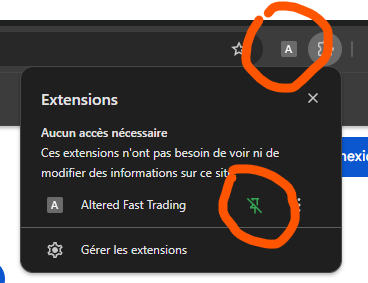
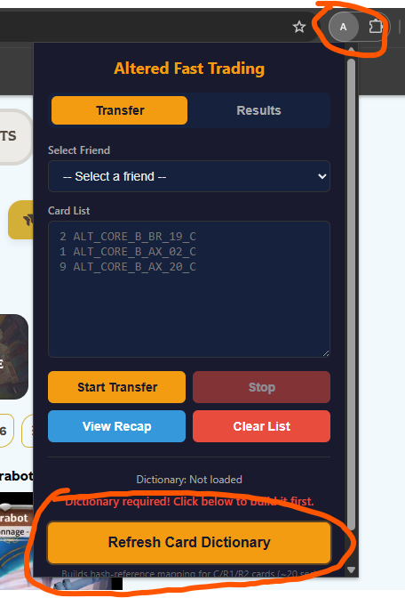
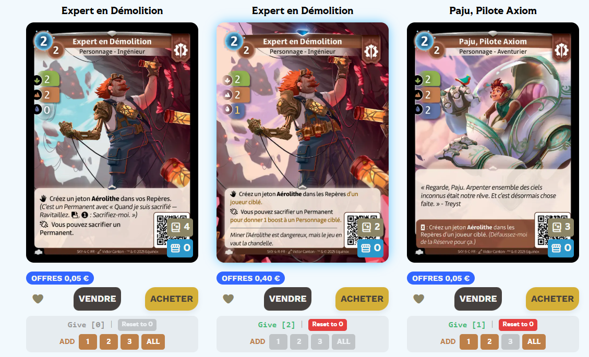
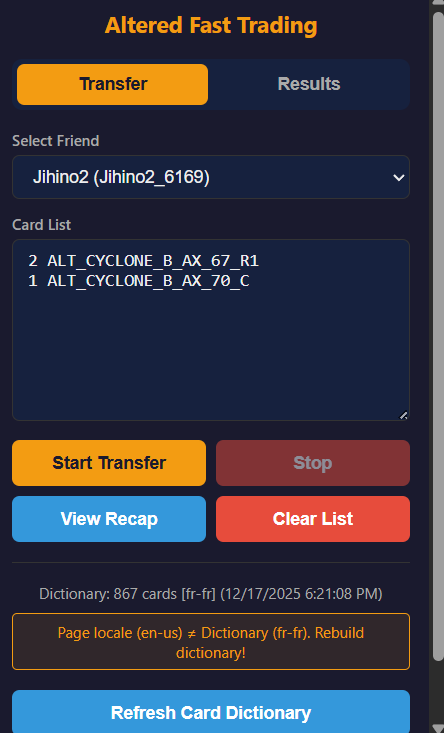
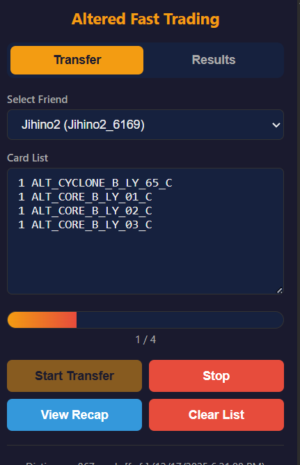
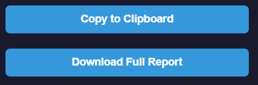

# Altered Fast Trading Tutoriel

## Installation

Chrome-like (Chrome, Brave, Edge...) ✅ : Vous pouvez l'installer [ici](https://chromewebstore.google.com/detail/altered-fast-trading/pieoadkiiellgnjbhjcackanefcmjohm?authuser=0&hl=en)

Firefox ❌

Autres ❌

Épinglez l'extension pour qu'elle soit visible dans votre barre d'outils.

## Initialisation

Ouvrez le site [altered.gg](altered.gg) dans la langue que vous souhaitez et connectez vous!

Clickez sur l'extension, et appuyez sur le boutton "Refresh Card Dictionary"

Cliquez sur l'extension et appuyez sur le bouton "Refresh Card Dictionary".

*/!\ Important /!* Le "Card Dictionary" est essentiel et est lié à la langue de la page. Si vous changez la langue du site, il faudra réappuyer sur ce bouton !

## Ajouter des cartes

Actualisez la page (F5), vous devriez voir apparaître ces boutons sur les cartes échangeables.

Si les boutons sont gris alors que vous possédez des cartes, actualisez la page.

*/!\ Attention /!* Lorsque vous appuyez sur un des boutons, cela ajoute ou retire des cartes de votre liste ! Aucun don n'est effectué !

Après avoir appuyé sur "2" pour la deuxième carte et "1" pour la troisième, voici ma liste :

Si vous souhaitez un récapitulatif visuel, vous pouvez cliquer sur le bouton View Recap.

Vous pouvez aussi modifier la liste à la main.

## Lancer un transfer

Choisissez votre ami dans la liste déroulante.

Attention, choisissez bien !!!

Appuyez sur "Start Transfer".

Le transfert se lance.

Vous pouvez rendre l'extension "invisible" (fermer la petite fenêtre en cliquant n'importe ou en dehors). Ce n'est pas grave si elle quitte l'écran, le transfert se passe toujours en arrière-plan.

Vous pouvez recliquer sur l'extension pour voir la progression du transfert.

Vous pouvez changer d'onglet et faire votre vie, il n'y a pas de souci, tout fonctionne en arrière-plan !

Note : Ne fermez pas le navigateur. Ne fermez pas votre onglet Altered.   

Une fois terminé, vous pouvez retrouver votre récapitulatif dans "Results".

Tout en bas se trouvent deux boutons :

- Le premier si jamais vous voulez copier la liste de votre transfert (toujours pratique).

- Le second s'il y a eu des erreurs : vous pouvez télécharger un fichier texte qui les répertorie.